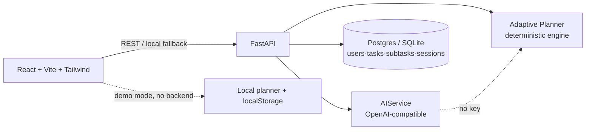

# StudyFlow AI
**Turn school chaos into a plan that actually works.**
> "Schoolwork, finally under control."

CSC Back-to-School Hackathon submission — solo build. Students don't need another list of things to do. They need to know what matters most *right now*.

## Problem
Students have assignments, quizzes, exams, projects and activities scattered everywhere. They know WHAT to do but not WHAT to do first, HOW MUCH time to spend, or whether they're falling behind.

## Solution
StudyFlow AI converts workload into an **Adaptive Academic Planner**: it prioritizes by deadline + effort + difficulty + importance + workload pressure, breaks big work into steps, generates a daily plan, watches Deadline Radar risk, and re-plans when life happens.

## Key Features
- 📊 **Dashboard** — Focus Now card, timeline, deadlines, AI insight, progress (judge-first 60 seconds)
- 🔮 **What should I do now?** — exactly ONE next action with WHY + TIME (signature feature)
- 🛟 **Rescue My Week** — before/after rebalance, splits big tasks, protects Friday evening
- 📡 **Deadline Radar** — Safe / Watch / At Risk scanning with recommendations
- 🔁 **"I couldn't finish this"** — automatic rescheduling with before/after explanation
- ⏱️ **Focus mode** — distraction-free timer; Easy/Normal/Hard feedback tunes future estimates
- ✅ Tasks (CRUD, subtasks, progress, filters), 📅 Calendar with Optimize Week, 📈 Analytics + AI Weekly Review, 💬 StudyFlow Assistant (DB-aware, not a generic chatbot)
- 🌗 Light/dark mode, responsive (desktop/tablet/mobile + bottom nav), keyboard-accessible, empty states, skeletons

## Architecture


## Tech Stack
Frontend: React 18, TypeScript, Vite, Tailwind CSS, Framer Motion, Lucide, React Router.
Backend: Python FastAPI, Pydantic, httpx. DB: PostgreSQL (Supabase-ready `schema.sql`), local run uses in-memory + SQLite-friendly models.
AI: `AIService` abstraction — any OpenAI-compatible endpoint; key stays server-side; deterministic planner fallback labelled "demo intelligence mode" (never shows "API key missing").

## How AI Was Used (summary — full detail in AI_DISCLOSURE.md)
AI tools assisted brainstorming, UI iteration, code generation, debugging and docs. The app itself uses AI (or the deterministic engine in demo mode) for plan generation, prioritization with reasons, risk detection, rescheduling, next-action and weekly reviews.

## Quickstart
### Frontend (works with ZERO backend — demo mode)
```bash
cd frontend
npm install
npm run dev      # http://localhost:5173
```

### Backend (optional — frontend works without it)
```bash
cd backend
pip install -r requirements.txt
uvicorn app.main:app --reload --port 8000
```
Set `VITE_API_URL=http://localhost:8000` in `frontend/.env` to use the live API.

### Environment variables
| Var | Where | Purpose |
|---|---|---|
| `OPENAI_API_KEY` | backend | enables AI-powered mode (else demo intelligence) |
| `OPENAI_BASE_URL` | backend | OpenAI-compatible endpoint (default openai.com/v1) |
| `OPENAI_MODEL` | backend | model name (default gpt-4o-mini) |
| `VITE_API_URL` | frontend | backend URL (optional) |
| `DATABASE_URL` | backend | Postgres URL for Supabase deploy (optional) |

See `.env.example` files in `backend/` and `frontend/`.

## Demo script (60 seconds for judges)
1. Open `/` → **Try Demo** → populated dashboard as Alex Morgan.
2. See **Focus Now** + why → click **What should I do now?** → one action.
3. **Start Focus Session** → Finish → difficulty feedback → plan adapts.
4. Click **Rescue My Week** → before/after rebalance.
5. Check Deadline Radar, Calendar → Optimize Week, Analytics → Weekly Review.

## API (excerpt)
`GET /api/tasks` · `POST /api/tasks` · `PATCH /api/tasks/:id` · `DELETE /api/tasks/:id` ·
`POST /api/plan/generate` (= `/api/ai/generate-plan`) · `POST /api/plan/optimize` ·
`POST /api/tasks/:id/reschedule` · `POST /api/focus/start|complete` ·
`GET /api/analytics` · `GET /api/insights` · `POST /api/ai/next-action` · `POST /api/ai/rescue-week` · `POST /api/ai/chat`

## Deployment
- Frontend → Vercel (`frontend/`, build `npm run build`, output `dist/`).
- Backend → Render (`backend/`, `uvicorn app.main:app --host 0.0.0.0 --port $PORT`).
- Database → Supabase Postgres: run `backend/schema.sql`.

## Future Improvements
Real Supabase Auth, drag-drop prioritization, class-schedule import, spaced-repetition exam prep, push reminders, PWA offline, teacher/family view.

## Impact
Fewer last-minute panics, calmer evenings, and students who always know the single most important next step — especially first-gen and overloaded students juggling school + work + family.
